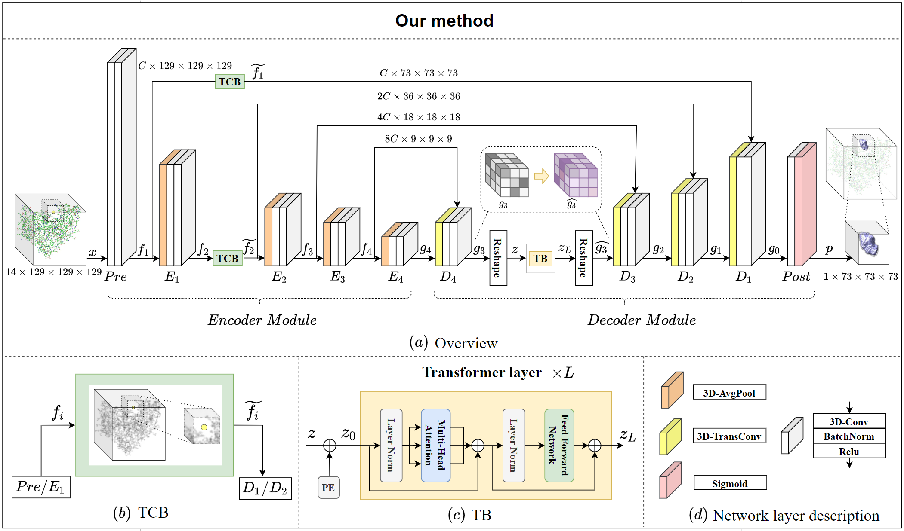

# GLPocket: A Multi-Scale Representation Learning Approach for Protein Binding Site Prediction

This repository contains the source code, trained models and the test sets for GLPocket.

## Introduction

Protein binding site prediction is an important prerequisite for the discovery of new drugs. Usually, natural 3D U-Net is adopted as the standard site prediction framework to do per-voxel binary mask classification. However, this scheme only performs feature extraction for single-scale samples, which may bring the loss of global or local information, resulting in incomplete, artifacted or even missed predictions. To tackle this issue, we propose a network called GLPocket, which is based on the 3D U-Net structure and utilizes multi-scale representation to predict binding sites. Firstly, GLPocket uses Target Cropping Block (TCB) for targeted prediction.
TCB selects the local interested feature from the global representations to perform concentrated prediction, and reduces the volume of feature maps to be calculated by 82% without adding additional parameters. It integrates global distribution information into local regions, making prediction more concentrated on decoding stage. Secondly, GLPocket establishes long-range relationship of patches within the local region with Transformer Block (TB), to enrich local context semantic information. Experiments show that GLPocket improves by 0.5%-4% on DCA Top-n prediction compared with previous state-of-the-art methods on four benchmark data sets.



## Dataset

**Train data:** Train dataset ``scPDB`` can be downloaded from here (http://bioinfo-pharma.u-strasbg.fr/scPDB/).

**Test data:** Test datasets can be downloaded according to the following links, `COACH420` (https://github.com/rdk/p2rank-datasets/tree/master/coach420),  `HOLO4k` (https://github.com/rdk/p2rank-datasets/tree/master/holo4k), `SC6K` (https://github.com/devalab/DeepPocket), `PDBbind` (http://www.pdbbind.org.cn/download.php).

You can also download our pre-processed train and test data RecurPocket_release/dataset from Baidu Cloud Disk (https://pan.baidu.com/s/1xgQYgtFsQXI2EofCxh60Bw code：4ua7)

## Data processing

For COACH420, HOLO4K, SC6K and PDBbind, the preprocessing procedure is the same as in [DeepPocket](https://github.com/devalab/DeepPocket). 

## Data Representation
Our method takes the whole protein structure as input in the form of a multi-channel 3D grid. We applied molgrid to voxelize the whole protein structure into multi-channel 3D grid data, and upsampled the data ($\times2$) with the shape like $C\times H\times W\times D$. C is the number of grid channels representing the atom types. Atom types are listed in Supplementary Materials. $H, W$ and $D$ are the height, width and depth of input data. The input shape in this work is  $14\times 129\times 129\times 129$.

In addition, under a given protein, we applied Fpocket to generate candidate centers. Fpocket is a fast prediction tool that predicts many pockets with high recall but low precision. The predicted pocket centers are regarded as candidate centers. Each candidate center is used as a prior to guide the network to focus on interested local regions  (called proposals) of a protein. This greatly reduces the volume of feature maps to be calculated by $82\%$.

Since the ligand in the protein-ligand complex is relatively sparse and cannot be directly used as true label for the predicted binding pocket, we use VolSite tool to generate cavity as ground truth label. We discard samples with ligands buried too shallow to obtain corresponding cavities. As shown in Fig. 1(a), the light colored transparent volume cavity is used as a protein binding site.

## Train

If you want to train GLPocket by yourself, the command is as follows:

```
cd GLPocket
chmod a+x run.sh
./run.sh

Note: in run.sh, 'data_root' is the directory where 'scPDB', 'test_types' are located.
```

## Test

#### 1. Pre-trained model

Download the pretrained model from https://pan.baidu.com/s/1BFmBJ1gvHpwyrt1uYbF47w code:ib9i

#### 2. Test

If you want to test GLPocket on coach420, holo4k, sc6k or pdbbind under DCC, DVO or DCA metrics, please run:

```
cd GLPocket
chmod a+x evaluation.sh
./evaluation.sh

Note: in evaluation.sh, you can set 'test_set', 'is_dca', 'top_n', 'data_root', 'ckpt_path' by yourself.
'ckpt_path' is the path of pre-trained model.
'data_root' is the directory where 'scPDB', 'test_types' are located.
'is_dca=0' represents the computation of DCC & DVO.
'is_dca=1, top_n=0' represents the computation of DCA (top-n).
'is_dca=1, top_n=1' represents the computation of DCA (top-n+2).
```
